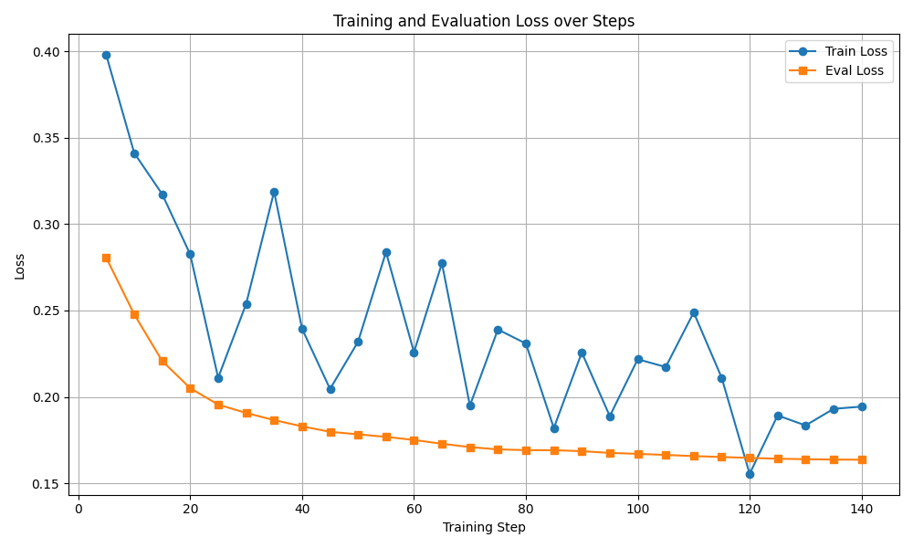

# Embeddings-based Code Search Engine (CoSQA)


A **semantic code search engine** built with [Sentence-Transformers](https://www.sbert.net/), [Qdrant](https://qdrant.tech/), and [FastAPI](https://fastapi.tiangolo.com/).

The system indexes code snippets and natural-language queries as embeddings, retrieves semantically relevant results, evaluates ranking performance on **CoSQA**, and fine-tunes the model for improved performance.

---

## 📚 Table of Contents

- [Overview](#overview)
- [Installation](#installation)
- [Running Qdrant](#running-qdrant)
- [Part 1 — Search Engine API](#part-1--search-engine-api)
- [Part 2 — Evaluation on CoSQA](#part-2--evaluation-on-cosqa)
- [Part 3 — Fine-tuning](#part-3--fine-tuning)
- [License](#license)

---

## 🧾 Overview

This project implements a **semantic code search engine** in three main stages:

1. **Embeddings-based search engine**  
   - Encodes and indexes text/code using a pretrained SentenceTransformer model.  
   - Provides FastAPI endpoints for document insertion and semantic search via Qdrant.

2. **Evaluation on CoSQA**  
   - Tests the system on the [CoSQA](https://huggingface.co/datasets/CoIR-Retrieval/cosqa) dataset.  
   - Computes ranking metrics: **Recall@10**, **MRR@10**, **nDCG@10**.

3. **Fine-tuning**  
   - Fine-tunes the embeddings model using **MultipleNegativesRankingLoss** on CoSQA’s training split.  
   - Demonstrates improved retrieval metrics on the test set.

## ⚙️ Installation

1. Clone the repository
```bash
git clone https://github.com/MaciejStranz/embeddings-code-search.git
cd embeddings-code-search
```
2. Create a virtual environment
```bash
python -m venv venv
source venv/bin/activate  # macOS/Linux
venv\Scripts\activate     # Windows
```
3. Install dependencies
```bash
pip install -r requirements.txt
```
## 🗄️ Running Qdrant

You can run Qdrant with provided docker-compose file
```bash
docker compose up -d
```
## 🧰 Part 1 — Search Engine API

### Run FastAPI
```bash
uvicorn backend.main:app --port 8000
```

When the application starts:
- **Qdrant automatically loads a small movie reviews dataset** as an initial collection for demonstration purposes. 
- You can provide a description of a film, and most relevant opinions will be returned. 
- The API becomes available immediately and can be tested via **Swagger UI**, which FastAPI provides by default.

### 🧪 Testing the API with Swagger UI

After starting the app, open your browser at:
👉 **http://localhost:8000/docs**

This interface (Swagger UI) allows you to:
- Test endpoints interactively (`/search`, `/insert_doc`, `/healthz`),
- View request/response schemas,
- Explore and debug API behavior without any external tools like Postman.

---
## 📊 Part 2 — Evaluation on CoSQA

Evaluate the engine on CoSQA with ranking metrics (Recall@10, MRR@10, nDCG@10).

```bash
python run_eval.py
```

Metrics calculated with pretrained model and CoSQA dataset:
```
=== CoSQA Evaluation (split=test, k=10) ===
queries_evaluated: 500
Recall@10: 0.5340
MRR@10: 0.2455
nDCG@10: 0.3125
```

The evaluation automatically checks if a Qdrant collection already exists — if not, it indexes the corpus first.

---
## 🧩 Part 3 — Fine-tuning

Fine-tune the base SentenceTransformer model on CoSQA using **MultipleNegativesRankingLoss (MNLR)**.

This loss leverages in-batch negatives and is particularly effective for semantic similarity and code search tasks.

Run:
```bash
python run_finetuning.py
```

During training:
- Checkpoints are saved **every 10 steps** and logs are saved **every 5 steps**
- Files generated:
  ```
  models/cosqa-ft-trainer/trainer_log.jsonl
  models/cosqa-ft-trainer/trainer_state.json
  models/cosqa-ft-trainer/final/
  ```

After training, evaluate again with:
```bash
python run_eval.py --model=models/cosqa-ft-trainer/final --collection=cosqa_new_collection
```

Metrics calculated with fine-tuned model and CoSQA dataset:
```
=== CoSQA Evaluation (split=test, k=10) ===
queries_evaluated: 500
Recall@10: 0.5860
MRR@10: 0.2467
nDCG@10: 0.3252
```

MRR@10 metric did not improve, nDCG@10 improved by about 0.01 and Recall@10 improved by 0.05. Model was fine-tunned on only 10 000 samples beacuse of the duration of calculations, so even this slight improvement shows the potential of fine-tuning.

---

### 📉 Visualizing Training Progress (Loss Curves)

The file `trainer_state.json` contains the full training and evaluation loss history.

To visualize the training process, use the provided script `plot_loss.py`:

```bash
python plot_loss.py
```

This script:
- Loads `trainer_state.json`
- Extracts `train_loss` and `eval_loss` values per step
- Plots and saves the loss curve to `loss_curve.png`

Example usage:
```bash
python plot_loss.py
```

Result:

- The figure shows how the loss decreases with each training step. The fact that the loss function values continued to decrease in the final steps means that further fine-tuning of the model would likely have resulted in even better improvement in the metrics.
- The plot is automatically displayed and saved as:
  ```
  loss_curve.png
  ```

---

📜 License
This project is released under the MIT License.

Author: Maciej Stranz
Date: November 2025
